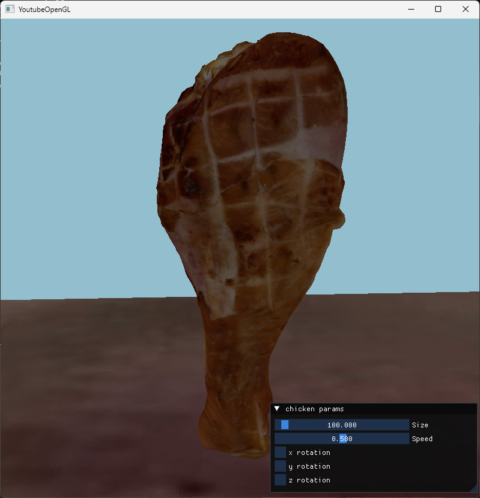

# OpenGL Model Viewer

Ein kleines Projekt zum Anzeigen von **3D-Modellen**, entwickelt mit **C++**, **OpenGL**, **GLFW**, **GLAD**, **GLM** und **ImGui**.

Die Anwendung macht es möglich, importierte Modelle in Echtzeit anzusehen und direkt zu bearbeiten.

## Features

- **Import von 3D-Modellen im glTF-Format**
- **Rotation des Modells auf allen Achsen** (**X, Y, Z**)
- **Einstellbare Rotationsgeschwindigkeit**
- **Skalierung des Modells**
- **Benutzeroberfläche mit ImGui**

## Projektstruktur

Damit ein Modell korrekt erkannt wird, muss die Ordnerstruktur ungefähr so aussehen:

```text
Source/
└── ModelFolder/
    ├── model.gltf
    └── textures/
        └── texture_B.png
```

